# I’m @petermatts

My real name is Matthew Peters.

GitHub required I make a unique username for my account, and after a little bit of thinking I came up with my solution.

My last name ends in an 's', and without that 's' my name is made of 2 common first names (Matt and Peter). I decided to swap my first (abbreviated) name and last name leaving the 's' in its place to get peter + matt + s = petermatts, a unique username.

<details>

<summary markdown="span">
    <u>Click here to show process in code form</u>
</summary>

```Java
public static String username() {
    String myName = "Matthew Peters"; //my name
    myName = myName.toLowerCase(); //make lowercase

    //split into an array (first name at index 0, second name at index 1)
    String[] names = myName.split(" "); 

    //create var for first name, using substring to abreviate to an alternative form
    String firstname_short = names[0].substring(0, 4); //matt

    String lastname = names[1]; //create var for last name (peters)
    String s = "";

    //if lastname ends in "s": s="s" and trim off last 's' from lastname
    if(lastname.endsWith("s")) {
        s = "s";
        lastname = lastname.substring(0, lastname.length()-1); //peter
    }

    // my_github_username = "peter" + "matt" + "s"
    String my_github_username = lastname + firstname_short + s;
    return my_github_username; //petermatts
}
```

*example code for this process as a Java method*</details>

<!-- <details><summary markdown="span"><u>Click here to show process in code form</u></summary>

```Python
    name = "Matthew Peters"
    data = name.lower().split(" ")
    github_username = data[1][:-1] + data[0][:4] + data[1][-1:]
    print("Python:", github_username)
```
*example code for this process as a Java method*</details> -->

<!-- --- -->

## About me

### **Education**

- UMass Amherst 2025 M.S. in Computer Science
- UMass Amherst 2024 B.S. in Computer Science and Mathematics
- Nashua (New Hampshire) High School North class of 2020

Main educational focus: Machine Learning and Artificial Intelligence

<!-- Separate tables by math vs cs classes? -->

<!-- ## **Important Courses**
       
| Completed                               | Upcoming Fall 2024                      |
| --------------------------------------- | --------------------------------------- |
| Introduction to Algorithms              | Quantum Information Systems (Grad)      |
| Intro to Scientific Computing           | Reinforcement Learning                  |
| Artificial Intelligence                 | Computer Vision                         |
| Intro to Machine Learning               |                                         |
| Machine Learning (Grad)                 |                                         |
| Machine Learning (Ph.D)                 |                                         |
| Reasoning Under Uncertainty             |                                         |
| Computer Systems Principles             |                                         |
| Applied Cryptography                    |                                         |
| Formal Language Theory                  |                                         |
| Intelligent Visual Computing            |                                         |
| Intro to Simulation                     |                                         |
| Quantum Information Systems (Undergrad) |                                         |


### **Other cool/interseting courses**

- Using Data Structures
- Programming with Data Structures
- Programming Methodology
- Web Programming
- Intro to Computation
- Multivariable Calculus
- Linear Algebra
- Differential Equations
- Statistics I
- Intro to Abstract Algebra I
- Intro to Computer Graphics -->

## **My Projects/Repositories**

For much greater detail into my past and current projects (both public and private) as well as my future ideas, see [`Repos.md`](https://github.com/petermatts/petermatts/blob/main/Repos.md) for more information.

## **Languages, Tools, Skills, and More!**
<!-- Cool site for logos https://worldvectorlogo.com/ -->
<!-- Icons from https://github.com/lelouchfr/skill-icons -->

Below is a list of languages, tools, and skills I have used. Hover the icons to see the name if you are unfamiliar with the icon logo.

### Languages

<!--  -->

[](? "Python")
[](? "Javascript")
[](? "Typescript")
[](? "C")
[](? "C++")
[](? "Java")
[](? "Matlab")
[](? "Bash")
[](? "Latex")

[](? "Julia")
[](? "yaml")
[](? "HTML")
[](? "CSS")
[](? "Go")
[](? "R")
[](? "Postgres SQL")
[](? "Powershell")
[](? "Markdown")

More Languages that did not have icons in the API I used to make this.

[](? "SWIG")
[](? "CUDA")
[](? "Mathmatica")
[](? "Doxygen")


### Libraries

[](https://github.com/petermatts "PyTorch")
[](? "Numpy")
[](? "Matplotlib")
[](? "Scikit-Learn")
[](? "Scipy")
[](? "Tensorflow")
[](? "Regex")

[](? "pandas")
[](? "Selenium")
[](? "NodeJS")
[](? "Firebase")
[](? "React & React Native")
[](? "Redux")
[](? "ThreeJS")

### Tools

[](? "Git")
[](? "Github")
[](? "Gitlab")
[](? "Bitbucket")
[](? "CI/CD")
[](? "Jenkins")
[](? "CMake")

[](? "Jira")
[](? "VSCode")
[](? "Visual Studio")
[](? "Atom")
[](? "Desmos")
[](? "Android Studio")
[](? "XCode")

### Other

[](? "Google Workspace")
[](? "Microsoft Word")
[](? "Microsoft Excel")
[](? "Microsoft Powerpoint")
[](? "MacOS")
[](? "Linux")
[](? "Windows")

### Profiles/Contact

[](? "petermatts")
[](https://www.linkedin.com/in/matthew-s-peters/ "Matthew Peters")
[](https://www.instagram.com/pete.matt/ "pete.matt")
[](? "petermatts")
[](? "mpeters0514@gmail.com")

## Fun Facts/More about me

- Did you know that on windows the keyboard short cut `ctrl+alt+shift+windows+L` automattically takes you to LinkedIn in your browser?

- Did you know that Desmos uses Latex? So you can copy a raw Latex formula into desmos without needing to retype the whole thing.

- Did you know that someone took the time and effort to create https://guthib.com incase you accidentally spell github incorrectly?

- More coming soon

## GitHub Data

<!-- Refer to https://github.com/marketplace/actions/metrics-embed for more metrics svg stuff -->


<!--  -->
<!--  -->
<!-- removed Jupyter Notebook and LaTeX -->


<!-- Shows rank -->
<!--  -->
